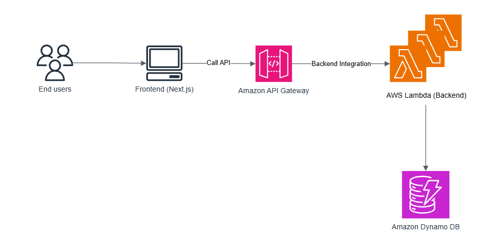

# MCU Internal

MCU Internal is a web application that helps manage MCU's served customers.

## Tech Stack

- **Frontend:** [Next.js](https://nextjs.org/): A React framework with built-in routing, SSR/SSG support, and fast performance.
- **Backend:**
  - API Gateway – Handles HTTP requests and routes them to Lambda functions.
  - AWS Lambda – Serverless functions that process business logic and interact with the database.
  - DynamoDB – A fast and scalable NoSQL database for storing application data.
- **Infrastructure as Code:** [SST](https://sst.dev/) – Simplifies the development and deployment of serverless applications on AWS.

## Architecture Diagram



## Run Locally

Clone the project

```bash
git clone https://github.com/nguyen-duc-loc/mcu-internal.git
```

Go to the project directory

```bash
cd mcu-internal-website
```

Rename `.env.example` file to `.env`. Then edit your environment variables. You don't need to define API_BASE_URL. Run the following commands:

```bash
npx sst deploy --stage=<YOUR_STAGE>
```

This command will output the API Gateway endpoint like this `https://<SOME_HASH>.execute-api.<YOU_AWS_REGION>.amazonaws.com`. Copy this endpoint to the variable `API_BASE_URL` in .env file.

Install dependencies

```bash
npm install --force
```

Start the server in development mode

```bash
npm run dev
```

Open [http://localhost:3000](http://localhost:3000) with your browser to see the result.
